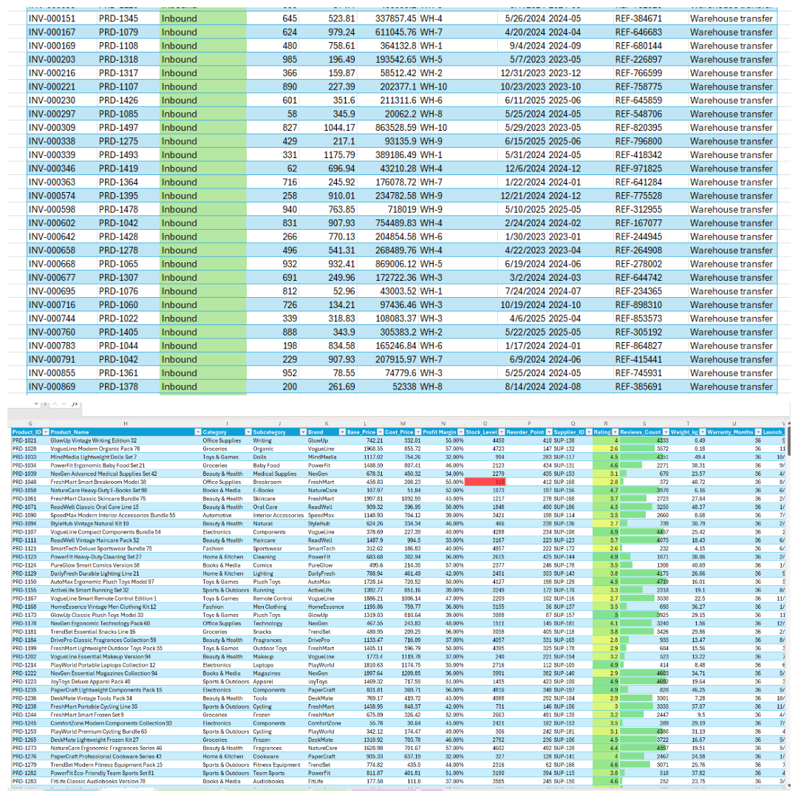
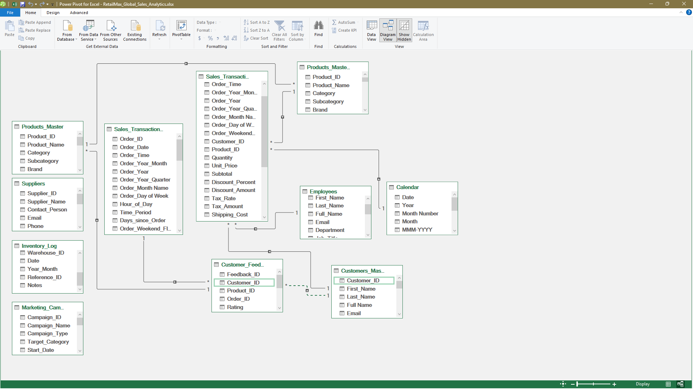
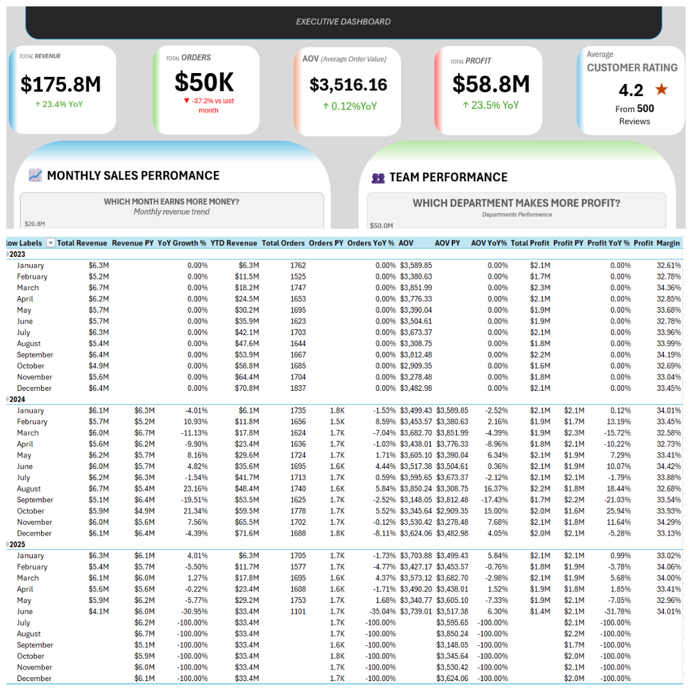
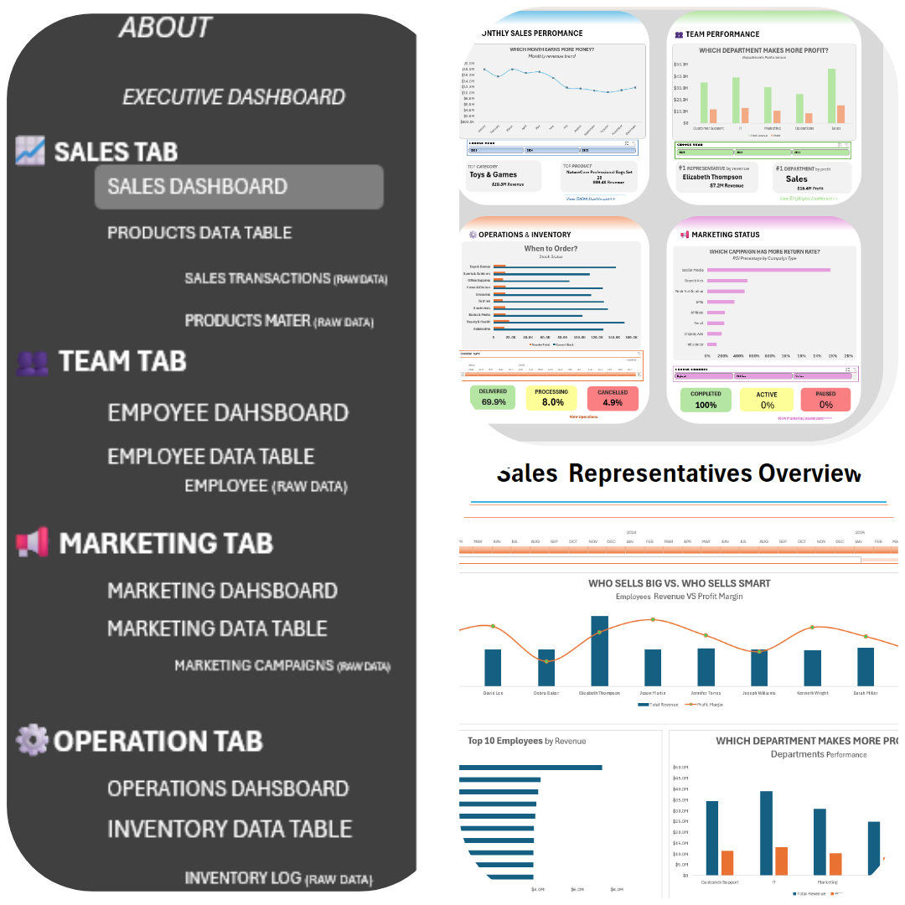

<h1 align="center">📊 RetailMax Global — Executive Analytics Dashboard</h1>

  <b>End-to-end Excel BI solution</b> built on 50K+ transactions across 5 business segments. 

  
  
  
  

---

## ⚡ Quick Stats

| Metric | Value |
| :--- | :--- |
| **🗃️ Records** | 50K transactions · 500 products · 50 employees · 2K customers · 500 reviews . 10k inventory . 200 suppliers |
| **📑 Sheets** | 18 total (1 Executive Dashboard . 4 segment based dashboards · 5 detailed pivot data table · 8 cleaned and formatted raw data) |

---

---

## 🛠️ What I Built (Skills Breakdown)

### 1️⃣ Power Query — ETL Pipeline

* Extracted and normalized ***8 disconnected raw tables*** from a single source workbook.(here's 2 of them)  
* Executed data cleaning protocols: text standardization, column splitting, explicit null-value management, and whitespace trimming.  

### 2️⃣ Data Modeling — Star Schema  
  
* Engineered a robust **Star Schema** linking a central `Sales_Transactions` fact table to 4 unique dimension tables (`Products_Master`, `Customers_Master`, `Employees`, and `Marketing_Campaigns`).  
* Generated a dedicated, continuous **Date Table** to safely host advanced time-intelligence calculations.  
* Formed standard **1-to-many relationships** across core identity keys (`Product_ID`, `Customer_ID`, `Employee_ID`, `Campaign_ID`).  

### 3️⃣ DAX —  Intelligences & KPIs   
  
*Built a dynamic KPI engine with DAX intelligence.  
*live metrics + automatic YoY comparisons that recalculate across any date, country, or category filter. Zero hardcoded values. Zero manual updates.  

### 4️⃣ Dashboard UI/UX Design
 
* Designed a contemporary **dark navigation sidebar** using icon-based hyperlinks for a seamless app-like interface.    
* Replaced chunky default filters with sleek, horizontal **pill-style slicers** matching modern dashboard aesthetics.  
* Integrated conditional context cues, including real-time `LIVE` status badges and responsive Red/Yellow/Green border alerts.  

---
---

## 🚀 How to Use

1. **Open:**  Download the file open in excel.
2. **Navigate:** Move between sheets using the left sidebar menu or the Executive Dashboard quick links.
3. **Filter:** Narrow down analytical scopes by interacting with the custom pill-style slicers (`Year` · `Quarter` · `Country` · `Category`).
4. **Drill Down:** Jump to targeted segments instantly via specialized sub-dashboards.

> ⚠️ **Production Security:** Formula sheets, chart architecture, and background data sheets remain locked. Production parameters require administrative credentials to unlock.  
> ⚠️ **Data Refresh:** To change the values or test the values you will need the source file ("Raw Data_RetailMax").  You can refresh other data and tables by refreshing all.
---
---

  <b>Built for portfolio demonstration</b> 
  Dataset: RetailMax Global e-commerce Records (2023–2025)

